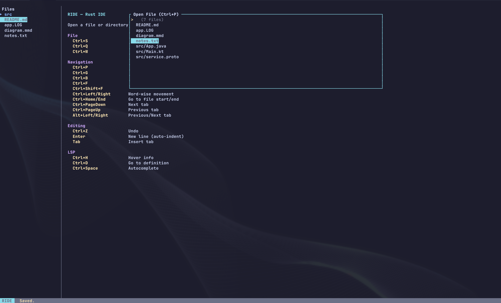

# RIDE

[](https://github.com/mhabulazm/ride/actions/workflows/ci.yml)
[](LICENSE)

A minimalist, fast, terminal-based IDE built in Rust.



## Highlights

- **Tree-sitter** syntax highlighting for Rust, Python, TypeScript, JavaScript, Go, C/C++, Java, Markdown, HTML
- **LSP** integration — diagnostics, hover, go-to-definition, autocomplete, code actions, find references, format document
- **Git** change markers in the gutter (added/modified/removed) with a live diff against HEAD
- **Markdown preview** (toggle with Ctrl+E)
- **Fuzzy file finder**, cross-file search, code folding, bracket matching, file operations in explorer
- **Configurable** themes, keybindings, and autosave
- **Fast** — large file streaming via ropey, incremental parsing

## Installation

### From source

```bash
git clone https://github.com/mhabulazm/ride.git
cd ride
cargo install --path crates/ride-tui
```

### Build only

```bash
cargo build --release
# Binary: target/release/ride
```

## Usage

```bash
# Open a directory
ride ./project

# Open a single file
ride ./src/main.rs
```

## Keybindings

| Key | Action |
|-----|--------|
| Ctrl+S | Save |
| Ctrl+Q | Quit |
| Ctrl+Z | Undo |
| Ctrl+E | Toggle Markdown preview |
| Ctrl+B | Toggle file explorer |
| Ctrl+P | Fuzzy file finder |
| Ctrl+G | Go to line |
| Ctrl+F | Search in file |
| Ctrl+Shift+F | Search across files |
| Ctrl+W | Close tab |
| Ctrl+H | LSP hover info |
| Ctrl+D | LSP go to definition |
| Ctrl+Space | LSP autocomplete |
| Ctrl+. | LSP code actions |
| Ctrl+Shift+R | LSP find references |
| Ctrl+Shift+I | LSP format document |
| Ctrl+[ / ] | Toggle fold / unfold all |
| Ctrl+Left/Right | Word-wise movement |
| Ctrl+Home/End | File start/end |
| Ctrl+PageDown/Up | Next/previous tab |

### Explorer (when focused)

| Key | Action |
|-----|--------|
| n | New file |
| N | New folder |
| r | Rename |
| d | Delete (confirm with y) |

All keybindings are shown on the welcome screen. Use `"keymap_preset": "mac"` in `settings.json` to swap Ctrl for Cmd.

See [keybindings.json](keybindings.json) for the full default map and customization format.

## Supported Languages

| Extension | Language | Highlighting |
|-----------|----------|-------------|
| `.rs` | Rust | tree-sitter |
| `.py` | Python | tree-sitter |
| `.ts`, `.tsx` | TypeScript | tree-sitter |
| `.js`, `.jsx` | JavaScript | tree-sitter |
| `.go` | Go | tree-sitter |
| `.c`, `.h` | C | tree-sitter |
| `.cpp`, `.cc`, `.hpp` | C++ | tree-sitter |
| `.java` | Java | tree-sitter |
| `.md` | Markdown | tree-sitter |
| `.html`, `.htm` | HTML | tree-sitter |
| `.kt` | Kotlin | regex |
| `.proto` | Protocol Buffers | regex |
| `.log` | Log files | regex |
| `.mmd` | Mermaid diagrams | regex |
| `.txt` | Plain text | none |

## Configuration

RIDE reads two optional JSON files from the working directory:

### settings.json

```json
{
  "autosave_interval_secs": 300,
  "theme": "monokai",
  "keymap_preset": "mac",
  "lsp": {
    "rs": { "command": "rust-analyzer", "args": [] },
    "py": { "command": "pylsp", "args": [] },
    "ts": { "command": "typescript-language-server", "args": ["--stdio"] }
  }
}
```

Set `autosave_interval_secs` to `0` to disable autosave. LSP servers start on demand per file extension.

### Themes

Built-in: `dark` (default), `light`, `monokai`, `solarized-dark`, `colorblind` (red-green-safe, Okabe-Ito palette).

Custom overrides on top of a base theme:

```json
{
  "theme": {
    "base": "dark",
    "syntax": {
      "keyword": { "fg": "#ff79c6", "bold": true },
      "string": { "fg": "#f1fa8c" }
    },
    "ui": {
      "border_focused": "#bd93f9",
      "git_added": { "fg": "#0072B2", "bg": "#0a1f2e" },
      "git_modified": { "fg": "#E69F00" },
      "git_removed": { "fg": "#D55E00" }
    }
  }
}
```

Colors can be named (`red`, `cyan`, `darkgray`) or hex (`#ff5733`).

## Architecture

```
ride/
├── crates/
│   ├── ride-core/   # Core library (UI-agnostic)
│   └── ride-tui/    # Terminal UI frontend (ratatui)
```

The core is decoupled from the UI, allowing future frontends (e.g. GUI via egui/iced) without rewriting editor logic.

## Tests

```bash
cargo test
```

132 unit tests covering buffer operations, auto-indent, word movement, bracket matching, code folding, tab management, keymap parsing, search, fuzzy finder, settings, themes, and LSP message parsing.

## Roadmap

See [ROADMAP.md](ROADMAP.md) for planned features.

## Contributing

Contributions are welcome! Please open an issue to discuss larger changes before submitting a PR.

## License

[MIT](LICENSE)
